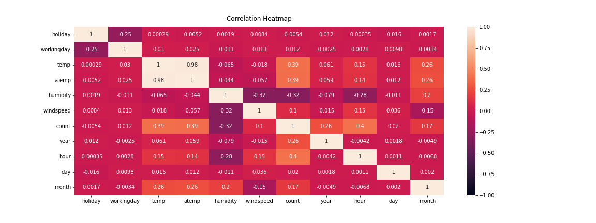
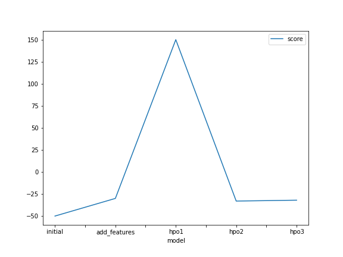
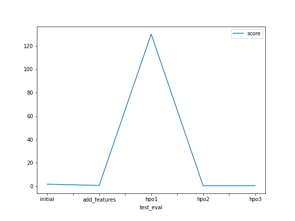

# Report: Predict Bike Sharing Demand with AutoGluon Solution
#### Babs Khalidson 

## Initial Training
### What did you realize when you tried to submit your predictions? What changes were needed to the output of the predictor to submit your results?
I had to remove any negative values as Kaggle doesn't accept negative predictions

### What was the top ranked model that performed?
The top ranked model was the weighted ensemble l3

## Exploratory data analysis and feature creation
### What did the exploratory analysis find and how did you add additional features?
The exploratory data analysis helped to reveal the distribution of the features. For instance the datetime feature had a multi modal distribution which meant that there were several patterns of response. Moreover the windspeed metric had a right skew distribution which meant that the mode of the distribution was < 20. 

I also created a correlation matrix heatmap and found that the "hour" feature had the highest correlation with the "Count" target variable while humidity had the lowest correlation. 

Hence, I added additional features by splitting the datetime feature. 

### How much better did your model perform after adding additional features and why do you think that is?
The model was performed a lot better after addiing additional features. The score decreased from 1.8 to 0.787, where the lower the score the better. I believe that the decrease in score was mainly because breaking down the date into year, hour, day and month, this provided the model with more information to help with making predictions. 

## Hyper parameter tuning
### How much better did your model perform after trying different hyper parameters?
After trying new hyper parameters the model performed a lot better as i saw the score reduce from 0.78 to 0.45

### If you were given more time with this dataset, where do you think you would spend more time?
I do try to add more features and also run the search for a bit longer. 

### Create a table with the models you ran, the hyperparameters modified, and the kaggle score.
|model|num_trials|num_boost_round|time|score|
|--|--|--|--|--|
|initial|default|default|600|1.80|
|add_features|default|default|600|0.70|
|hpo1|5|100|600|1.29|
|hpo2|100|200|900|0.45|
|hpo3|200|300|900|0.52|

### Create a line plot showing the top model score for the three (or more) training runs during the project.

### Create a line plot showing the top kaggle score for the three (or more) prediction submissions during the project.

TODO: Replace the image below with your own.

## Summary
This was a great project on understanding how to train multiple models using AutoGluon. It was very valuable to see that adding new features to the model helped improved the Kaggle score. Hyperparameter tuning helped improve the score even more especially after running it for multiple rounds. 
